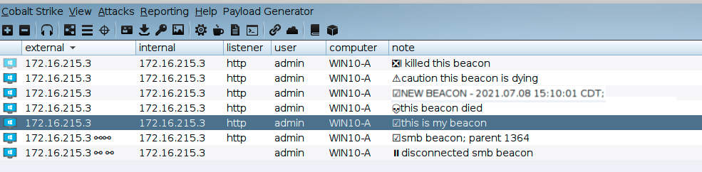
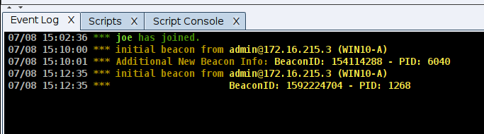

# Beacon Health Check Aggressor Script

Joe Vest (Twitter: @joevest)

## Description

This aggressor script uses a beacon's note field to indicate the health status of a beacon. This is done by ...

- Tracking the each beacon's current sleep/jitter time
- Calculating health based on a "max expected checkin time"
- Updating the note field with an approriate icon every minute using the event `heartbeat_1m`
- Labeling new beacons as "NEW" with the time of arival
- Adding beacon id and PID to the iniital beacon event log message

## Heath Checks and Icons

### ☑ - symbol indicates beacon as active and working

Calculated as last checkin is less than max expected check-in time `(sleep + (sleep * .01 * jitter))`

i.e., A beacon with `sleep 300 20` would have a max expected check-in time of `360` calculated as `300 + (300 * .01 * 20)`. 

### 💀 - symbol indicates beacon has died

Calculated as last checkin time is greater then max expected check-in time * 2. This is known as the "dead time".

i.e., A beacon with `sleep 300 20` would have a dead time of `720`. 

### ❎ - symbol indicates beacon has been killed by an operator.

If `beacon['alive']` is false, then an opertor killed/exited this beacon and the beacon acknowleded the exit command.

### ⚠ - symbol indicates beacon as dying

Calculated as last checkin is greater than the max expected check-in time and less than the dead time. 

### ⏸ - symbol indicates the beacon as paused. 

This is a linked beacon that has been disconnected but is still considered alive. These beacons depend on a parent for communication. Instead of marking these dead, they are marked paused. There is no great way to track processes of disconnected beacons.

The following shows what these icons look like in the Cobalt Strike client.

The beacon Id and PID has been added to the initial beacon event log message.

## Usage

Load the beaconhealth.cna file through the script manager.

Use the `get_BeaconHealthCheck_settings` function in the script console to view the beacon sleep/jitter tracker.

## What you should know about the script

- It uses the Note field. You are free to edit as you like. The first character of the note will be updated during a health check with the appropriate symbol.
- Linked beacons do not have a sleep. Sleeps are tracked by the parent of the linked beacon
- Sleep settings are not verified before tracked. Setting sleep on a dead beacon may cause the symbol to change before the actual sleep has been processed by the beacon.
- The health check is designed to monitor longer running beacons.
  - Health is measured every minute
  - This may still be too aggressive
  - You can adjust the timing by changing the heartbeat event that kicks off a check.
- The tracking database is not persistent. If you close the Cobalt Strike client and reconnect, the database will be refreshed and beacons may be marked as **NEW**